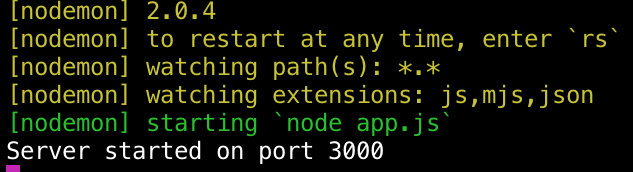
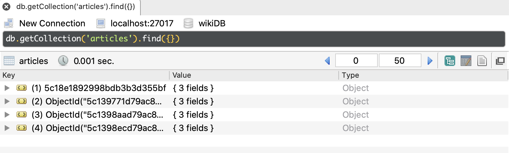
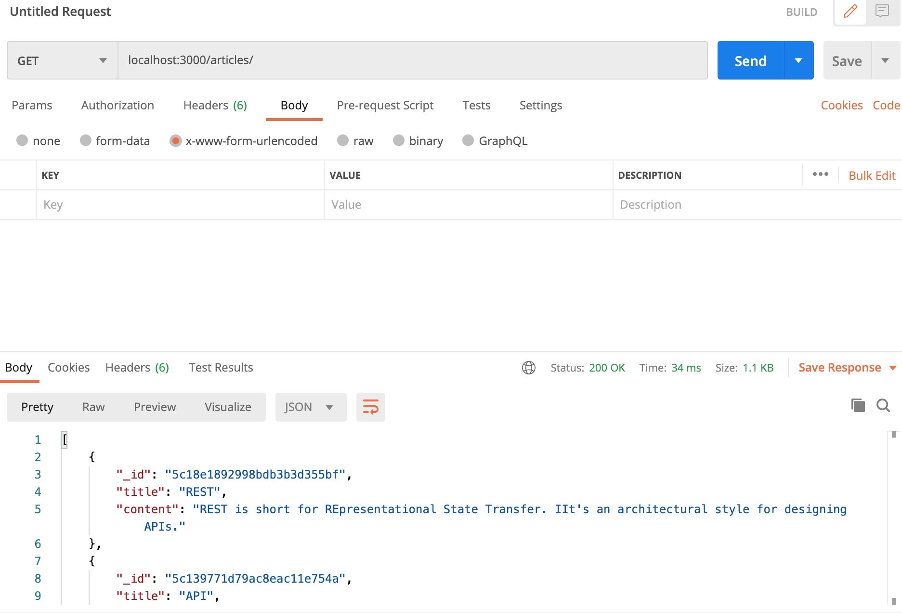

# Self-made-RESTful-API
<h1>Create RESTful API that can get, put, patch, and delete articles from a server.</h1>

The API was tested locally on port 3000.

Step1: The API code was run from command line.

Step2: We stored 4 articles in the Mongoose database.

The functionalizties of the API was tested with PostMan for getting, putting, patching, and deleting articles.

